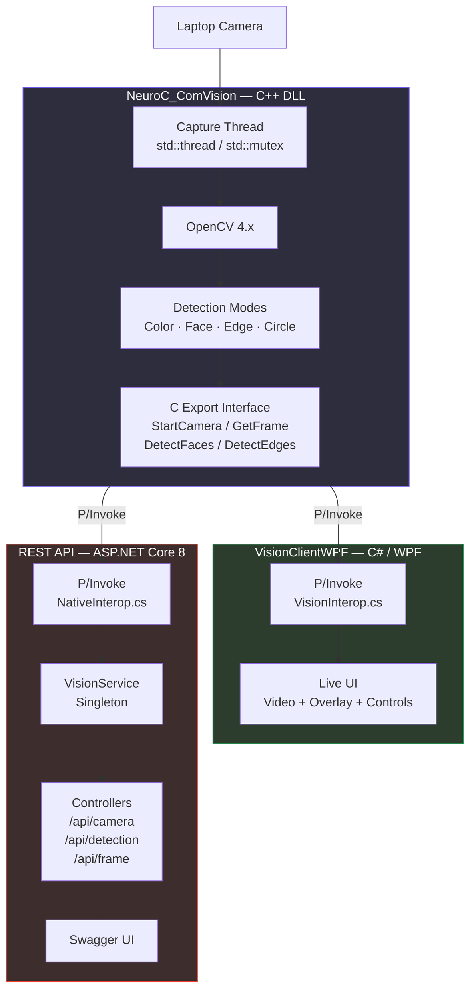

# VisionBridge

**Native C++ / OpenCV vision engine bridged to C# via P/Invoke**

---

This project is part of a series of small, focused technical playgrounds I maintain as a personal portfolio.
No grand ambitions here — just a concrete excuse to get my hands dirty with native/managed interop,
real-time image processing, and the kind of layered architecture you typically find in industrial vision software.

I originally started it while preparing for a technical interview at NeuroCheck (industrial image processing, Stuttgart).
It kept growing a bit after that because the problem space is genuinely interesting to work with.


## What this project is about

The core idea is simple: build a **C++ DLL** that captures frames from a laptop camera, runs various OpenCV-based
detection algorithms on them, and exposes everything through a clean **C-compatible export interface**.
Then consume that DLL from two independent C# clients — a **WPF desktop app** and an **ASP.NET Core REST API** —
both talking to the native layer through P/Invoke.

It simulates, on a small scale, the kind of architecture you would encounter in industrial vision systems:
a fast native processing core with managed consumers on top.


## Architecture




## Tech stack

| Layer | Technologies |
|-------|-------------|
| **Vision engine** | C++17, OpenCV 4.x, Windows DLL (`__declspec(dllexport)`), `std::thread`, `std::mutex` |
| **Desktop client** | C# / .NET 8, WPF, P/Invoke, `DispatcherTimer` for ~30 FPS rendering |
| **Web API** | ASP.NET Core 8, Swagger/OpenAPI, Singleton service wrapping native calls |
| **Interop** | `extern "C"` exports, `DllImport` with `CallingConvention.Cdecl`, manual struct marshalling |


## What has been implemented

### C++ DLL (`NeuroC_ComVision`)

- Camera capture running on a dedicated background thread with mutex-protected frame access
- **Color detection** — HSV filtering to isolate red objects, contour extraction, bounding box
- **Face detection** — Haar cascade (`haarcascade_frontalface_default.xml`), up to 32 simultaneous detections
- **Edge detection** — Canny algorithm with Gaussian pre-filtering, single-channel grayscale output
- **Circle detection** — Hough transform, results returned as bounding boxes
- Raw frame access (BGR native + RGB converted) with stride-aware metadata

### WPF Client (`VisionClientWPF`)

- Live camera feed rendered as `BitmapSource` (RGB24) at ~30 FPS
- Mode selector (Color / Face / Edge / Circle) with switchable overlay rendering
- Bounding box and ellipse overlays drawn on a `Canvas` layer, scaled to the video feed
- FPS counter, status display, start/stop controls

### REST API (`REST_API_NeuroC_Prep`)

- `CameraController` — start, stop, status, cascade loading
- `DetectionController` — color, face, circle, edge detection endpoints returning JSON
- `FrameController` — frame metadata, Base64-encoded RGB data, BMP image download
- `VisionService` — thread-safe singleton wrapping all native interop
- Swagger UI for quick manual testing


## Project structure

```
NeuroC_ComVision/
├── NeuroC_ComVision/          # C++ DLL — OpenCV processing engine
│   ├── NeuroC_ComVision.h     # Exported C interface (structs + functions)
│   └── NeuroC_ComVision.cpp   # Capture thread, detection algorithms
│
├── VisionClientWPF/           # C# WPF desktop client
│   ├── VisionInterop.cs       # P/Invoke declarations
│   ├── MainWindow.xaml        # UI layout (video + sidebar)
│   └── MainWindow.xaml.cs     # Rendering loop, detection dispatch, overlays
│
├── REST_API_NeuroC_Prep/      # ASP.NET Core 8 Web API
│   ├── Interop/NativeInterop.cs
│   ├── Services/VisionService.cs
│   ├── Controllers/           # Camera, Detection, Frame
│   └── Models/VisionDtos.cs
│
└── README.md
```


## Why it exists

I find that the best way to stay sharp on fundamentals is to build small things end to end.
Reading documentation about P/Invoke marshalling is one thing — actually debugging a struct layout
mismatch between C++ and C# at runtime is another.

This project let me revisit:

- Native/managed memory boundaries and struct alignment
- Thread safety across a DLL boundary
- Real-time frame rendering in WPF without drowning the UI thread
- Designing a REST layer on top of hardware-bound resources (one camera = one singleton)
- Keeping a clean separation between interop plumbing and application logic

Nothing revolutionary. Just practice that sticks.


## Disclaimer

This is a portfolio exercise, not a production system.
The code is intentionally kept straightforward — no over-engineering, no abstraction for abstraction's sake.
If you are looking for an industrial-grade vision framework, this is not it.


## Author

**Patrick Djimgou** — Germany

Part of a personal technical portfolio.
Built during interview preparation for NeuroCheck, kept around because fundamentals always age well.


