\# NeuroC\_ComVision

\## Brainstorming Playground - Interview Preparation Edition 😄

This project is NOT a revolutionary industrial vision framework. 
It is simply a technical brainstorming playground I built while preparing for a job interview at NeuroCheck.

Nothing overly ambitious.

Just structured thinking, architectural experiments, and hands‑on technical preparation.

------------------------------------------------------------------------

\## Purpose

The goal of this project was to:

\-   Practice C++ / OpenCV integration

\-   Design a clean DLL export interface

\-   Connect native C++ code with a C# WPF application

\-   Simulate a typical industrial vision software architecture

\-   Refresh multithreading and interop concepts before an interview

In short:

> A focused technical rehearsal --- nothing more, nothing less.

\## Architecture

```mermaid
graph TD
    CAM["📷 Laptop Camera"]

    subgraph DLL ["NeuroC_ComVision · C++ DLL"]
        direction TB
        CAPTURE["Capture Thread<br/><i>std::thread · std::mutex</i>"]
        OPENCV["OpenCV 4.x Engine"]
        DETECT["Detection Modes<br/>Color · Face · Edge · Circle"]
        CAPI["C Export Interface<br/><code>StartCamera · GetFrame<br/>DetectFaces · DetectEdges</code>"]
        CAPTURE --> OPENCV --> DETECT --> CAPI
    end

    subgraph WPF ["VisionClientWPF · C# WPF"]
        direction TB
        INTEROP_WPF["P/Invoke<br/><i>VisionInterop.cs</i>"]
        UI["Live UI<br/>Video · Overlay · Controls"]
        INTEROP_WPF --> UI
    end

    subgraph API ["REST API · ASP.NET Core 8"]
        direction TB
        INTEROP_API["P/Invoke<br/><i>NativeInterop.cs</i>"]
        SVC["VisionService<br/><i>Singleton</i>"]
        CTRL["REST Controllers<br/><code>/api/camera<br/>/api/detection<br/>/api/frame</code>"]
        SWAGGER["Swagger UI"]
        INTEROP_API --> SVC --> CTRL
        CTRL -.- SWAGGER
    end

    CAM --> CAPTURE
    CAPI -- "P/Invoke" --> INTEROP_WPF
    CAPI -- "P/Invoke" --> INTEROP_API

    style CAM fill:#4a90d9,stroke:#2c5f8a,color:#fff
    style DLL fill:#2d2d3d,stroke:#6c5ce7,color:#fff
    style WPF fill:#2d3d2d,stroke:#27ae60,color:#fff
    style API fill:#3d2d2d,stroke:#e74c3c,color:#fff
    style CAPTURE fill:#3a3a5a,stroke:#a29bfe,color:#fff
    style OPENCV fill:#3a3a5a,stroke:#a29bfe,color:#fff
    style DETECT fill:#3a3a5a,stroke:#a29bfe,color:#fff
    style CAPI fill:#4a3a6a,stroke:#d4a5ff,color:#fff
    style INTEROP_WPF fill:#3a5a3a,stroke:#6fcf97,color:#fff
    style UI fill:#3a5a3a,stroke:#6fcf97,color:#fff
    style INTEROP_API fill:#5a3a3a,stroke:#ff7675,color:#fff
    style SVC fill:#5a3a3a,stroke:#ff7675,color:#fff
    style CTRL fill:#5a3a3a,stroke:#ff7675,color:#fff
    style SWAGGER fill:#5a4a3a,stroke:#fdcb6e,color:#fff
```

------------------------------------------------------------------------

\## Technologies

\-   C++17

\-   OpenCV 4.x

\-   Windows DLL (native exports)

\-   Multithreading (std::thread, std::mutex)

\-   C# (.NET)

\-   WPF

\-   P/Invoke

------------------------------------------------------------------------

\##  What It Does

\-   Captures frames from the laptop camera

\-   Detects a red object using HSV filtering

\-   Computes a bounding box

\-   Displays X/Y coordinates in a WPF interface

That's it.

No machine learning. No deep learning. No enterprise scalability layer.

Just clean fundamentals.

------------------------------------------------------------------------

\## Why It Exists

Interview preparation should be practical.

Instead of only reviewing theory, I prefer to:

\-   Implement small, focused prototypes

\-   Revisit core architectural principles

\-   Validate cross-language integration

\-   Think through real-world design patterns

This repository reflects that mindset.

------------------------------------------------------------------------

\## ⚠ Disclaimer

This project is intentionally simple.

It is a preparation exercise, not a production system. Please do not

benchmark it against industrial-grade vision platforms 🙂

------------------------------------------------------------------------

\## 👤 Author

Patrick Djimgou\\

Germany\\

Interview preparation session -- NeuroCheck

------------------------------------------------------------------------

If you are reading this and expected something world-changing:

Sorry 😄\\

But fundamentals always win.

